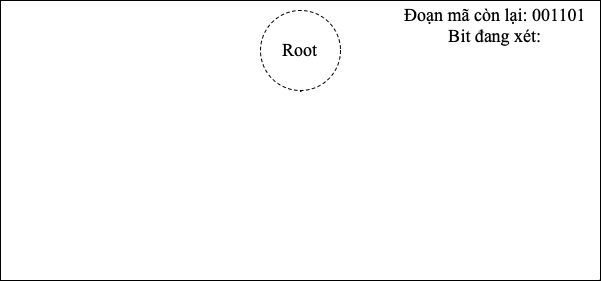

---
# try also 'default' to start simple
# theme: seriph
theme: the-unnamed
# random image from a curated Unsplash collection by Anthony
# like them? see https://unsplash.com/collections/94734566/slidev
background: https://source.unsplash.com/collection/94734566/1920x1080
# apply any windi css classes to the current slide
class: 'text-center'
# https://sli.dev/custom/highlighters.html
highlighter: shiki
# show line numbers in code blocks
lineNumbers: false
# some information about the slides, markdown enabled
info: |
  Huffman code
  Design and Analysis of Algorithms
# persist drawings in exports and build
drawings:
  persist: false
# page transition
transition: slide-left
# use UnoCSS
css: unocss
fonts:
  
  sans: 'Times New Roman'
  serif: 'Cormorant Garamond'
  mono: 'Fira Code NF'

hideInToc: true
---

# Huffman code and Tree

Thiết kế và đánh giá thuật toán

  
    Press Space for next page <carbon:arrow-right class="inline"/>
  

  Bùi Khánh Duy - Phạm Bá Thắng - Lê Thị Thuỳ Dung

<!--
The last comment block of each slide will be treated as slide notes. It will be visible and editable in Presenter Mode along with the slide. [Read more in the docs](https://sli.dev/guide/syntax.html#notes)
-->

---
layout: default
hideInToc: true
---

# Nội dung

<Toc></Toc>

---
layout: two-cols

image: imgs/Huffman-Coding-Problem-01-Solution-Constructed-Huffman-Tree.png

---
# Huffman là cái chi?

Mã hóa thông tin - nén dữ liệu dựa trên bảng tần suất xuất hiện của các ký tự trong dữ liệu đầu vào.

::right::

    

---
layout: iframe-right
url: https://cmps-people.ok.ubc.ca/ylucet/DS/Huffman.html
---

## Cấu trúc dữ liệu

***Cây nhị phân***

Các nút lá của cây chứa các ký tự và tần số của chúng, còn các nút cha chứa tổng tần số của hai nút con. Các cây con của nút được quy ước là trái - 0 và phải - 1 để tạo thành mã cho ký tự tương ứng.

---
layout: two-cols

class: 'text-center'

---
<iframe src="https://giphy.com/embed/RJb7MCYboxPPXeR2Y8" width="480" height="270" frameBorder="0" class="giphy-embed" allowFullScreen></iframe>
<a href="https://giphy.com/gifs/gigantosaurus-greedy-manger-gourmand-RJb7MCYboxPPXeR2Y8">via GIPHY</a>

::right::

  
  ## Tham lam
  **Giải thuật tham lam** (tiếng Anh: Greedy algorithm) là một thuật toán giải quyết một bài toán theo kiểu metaheuristic để tìm kiếm lựa chọn tối ưu địa phương ở mỗi bước đi với hy vọng tìm được tối ưu toàn cục

---
layout: center

class: 'text-left'

---

  
  ## Huffman tham lam?
  
  Thuật toán Huffman là một thuật toán tham lam, vì nó luôn chọn hai nút có tần suất thấp nhất để ghép lại thành một nút mới. Quá trình này được lặp lại cho đến khi chỉ còn một nút duy nhất là gốc của cây.

  Trong cây này, các ký tự có tần số xuất hiện cao sẽ được mã hóa bằng các bit ngắn hơn, trong khi các ký tự có tần số xuất hiện thấp sẽ được mã hóa bằng các bit dài hơn. Do đó, dữ liệu được nén sẽ có kích thước nhỏ hơn so với dữ liệu gốc.

---
class: px-20

---

# Thuật toán của Huffman code & Tree

  

    

    Hello World!
    

    
    <arrow 
    v-motion
    x1="380" y1="180" x2="380" y2="241" color="red" width="2" arrowSize="1" />
    
  

---
class: px-20
hideInToc: true
---
# Tạo các lá #1

  

    
    
    
  

---
class: px-20
hideInToc: true
---

# Tạo các lá #2

  

    
    
    
  

---
class: px-20
hideInToc: true
---

# Tạo các lá #3

  

    
    
    
  

---
class: px-20
hideInToc: true
---

# Tạo các lá #4

  

    
    
    
  

---
class: px-20
hideInToc: true
---

# Gộp các lá #1

  

    
    
    
  

---
class: px-20
hideInToc: true
---

# Gộp các lá #2

  

    
    
    
  

---
class: px-20
hideInToc: true
---

# Gộp các lá #3

  

    
    
  

---
layout: center

---

---
class: px-20
---
# Decode

<v-click>

</v-click>

<v-click>

</v-click>

<v-click>

</v-click>

<v-click>

</v-click>

<v-click>

</v-click>

<v-click>

</v-click>

<v-click>

</v-click>

<v-click>

</v-click>

<v-click>

</v-click>

<v-click>

</v-click>

<v-click>

</v-click>

<v-click>

</v-click>

---
layout: center
---
# Đánh giá thuật toán

---
layout: two-cols
hideInToc: true
---
## Ưu điểm
- Giảm kích thước của dữ liệu: các ký tự khác nhau = các mã có độ dài khác nhau. Tần suất nhiều ~ mã ngắn, tần suất ít ~ mã dài.

- Chỉ cần bảng Huffman là có thể giải mã chuỗi được nén mà không cần phải tải hết cả đoạn để dịch do Huffman tính toán trên từng bit.

::right::

## Nhược điểm

- Nếu tần suất xuất hiện quá thấp hoặc kí tự được biểu diễn bởi số bit ít hơn số bit Huffman cần để biểu diễn thì Huffman sẽ không tối ưu được dung lượng, thậm chí là tốn nhiều dữ liệu hơn.

::center::
Quan trọng nhất

---
class: px-20
---
# Đánh giá thuật toán

## Độ phức tạp

|              | Time Complexity | Space Complexity |
|--------------|----------------|-------------------|
| Tạo cây Huffman | $O(n\log n)$ | $O(n)$ |
| Mã hóa        | $O(n)$         | |
| Giải mã      | $O(n)$         | $O(n)$|

Nếu không phải sort => Tạo cây mất $O(n)$

---
class: px-20
---
# Ứng dụng

1. Nén tệp tin: Thuật toán Huffman được sử dụng để nén tệp tin với mục đích giảm kích thước của tệp và tăng tốc độ truyền tải.

2. Nén ảnh: Thuật toán Huffman được sử dụng để nén ảnh trong các định dạng như JPEG, GIF và PNG.

3. Nén âm thanh: Thuật toán Huffman được sử dụng để nén âm thanh trong các định dạng như MP3 và AAC.

4. Nén video: Thuật toán Huffman được sử dụng để nén video trong các định dạng như MPEG và H.264.

5. Truyền tải dữ liệu: Thuật toán Huffman được sử dụng để giảm kích thước của dữ liệu trước khi truyền tải qua mạng, giúp tăng tốc độ truyền tải và giảm chi phí băng thông.

6. Lưu trữ dữ liệu: Thuật toán Huffman được sử dụng để giảm kích thước của dữ liệu trước khi lưu trữ, giúp tiết kiệm không gian lưu trữ và tăng tốc độ truy cập dữ liệu.

---
layout: center
---

# Cải tiến

## LZW - Lempel-Ziv-Welch

---
layout: iframe
class: px-20
url: imgs/Recitation21VergheseFall2010.pdf
---

Nếu như chuỗi cần nén có ít chữ cái, ví dụ 1 chuỗi bit toàn 0 và 1 mà mỗi node chúng ta chúng ta lưu 1 kí tự, chuỗi chả được nén lại còn mất thêm dung lượng cho cây và số node
Vậy nên tham lam hơn, thay vì chúng ta chọn 1 kí tự chúng ta có thể chọn 1 cụm kí tự. Và đây là lý do LZ tham gia cùng với Huffman: dùng thuật toán tham lam LZ để tạo các chuỗi con vô cùng hiệu quả
Ở đây mình dùng LZW nhưng cải tiến để nó chia ra kích thước cho mỗi bộ mà mình mong muốn

---
class: px-20
hideInToc: true

---

# Phân chia bằng LZ

Hàm `lzw_split` có hai tham số đầu vào là chuỗi kí tự và kích thước cho mỗi bộ (ở đây mặc định 4 kí tự (128 bit))

Chuẩn bị: 1 mảng trống làm từ điển, 1 chuỗi rỗng a và 1 mảng rỗng làm đầu ra

- Bước 1: Lấy từng kí tự
- Bước 2: Tạo một chuỗi mới gồm chuỗi a và kí tự vừa được lấy và kiểm tra chuỗi đó có trong từ điển chưa
  - Nếu rồi thì gán chuỗi vừa rồi thành chuỗi a rồi chạy tiếp
  - Nếu chưa, ta thêm vào mảng trả về chuỗi a, thêm chuỗi vừa rồi vào từ điển nếu nó nhỏ hơn kích thước từ điển và gán kí tự đang xét vào chuỗi a
- Bước 3: Thêm kí tự còn lại vào mảng encoded

Do đặc trưng của LZ, nó sẽ tạo ra các chuỗi có độ dài tăng dần, có nhiều chuỗi là chuỗi con của 1 chuỗi khác trong dãy, vậy nên để tối ưu, chúng ta sẽ đệ quy để đảm bảo tỉ lệ 60% đầu ra đạt kích thước yêu cầu

Kết quả thu được là một mảng chứa các bộ kí tự

---
class: px-20
---
# Kết quả khi chạy bằng thuật toán LZW

---
class: px-20
---
# Tham khảo

- Huffman coding: https://en.wikipedia.org/wiki/Huffman_coding
- Huffman Coding | Greedy Algo-3: https://www.geeksforgeeks.org/huffman-coding-greedy-algo-3/
- Canonical Huffman code: https://en.wikipedia.org/wiki/Canonical_Huffman_code
- Deflate: https://zlib.net/feldspar.html
- MP3: https://en.wikipedia.org/wiki/MP3
- Lossless compression algorithms: https://en.wikipedia.org/wiki/Category:Lossless_compression_algorithms
- Open Specifications: https://learn.microsoft.com/en-us/openspecs/main/ms-openspeclp/3589baea-5b22-48f2-9d43-f5bea4960ddb
- LZW (Lempel–Ziv–Welch) Compression technique: https://www.geeksforgeeks.org/lzw-lempel-ziv-welch-compression-technique/

---
layout: end
---
# Cảm ơn các bạn đã theo dõi

  

   
Xem thêm tại:

  <!-- Your container content here -->
  

    <!-- Your element in the bottom right corner here -->
  

